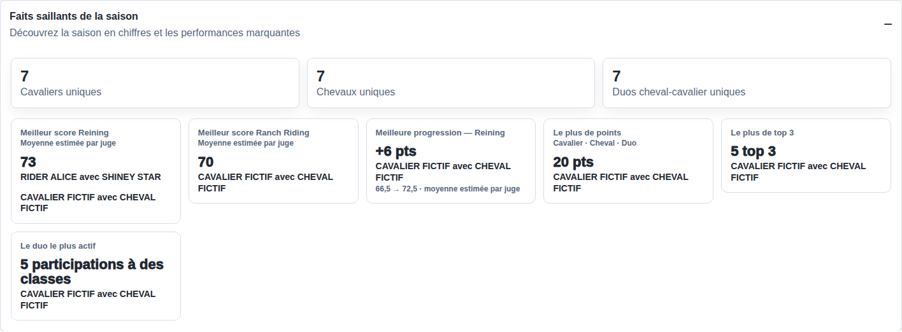
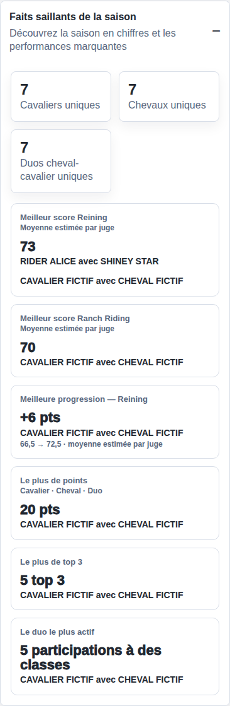

# Championship highlights and final titles — 2026-09-18

The public championship now has one collapsed season-highlights accordion immediately before the class list, on desktop and mobile. Its three counts use all included occurrence results, including zero-point and disqualified participants, with the existing stable-identity resolver. They do not sum class standings.

Performance distinctions explicitly exclude DQ (including imported DQ placement labels). Point records use stable rider/horse identities and retain all tied holders and occurrence contexts. A combined rider/horse/duo card requires a complete one-to-one match of leader sets, totals and positive-point contributions. Otherwise the records remain separate with partner context. Top 3 placings count classes separately; participation means class participation rather than a distinct arena run.

Score maxima and progression are hidden. The CSV/public occurrence contract does not carry a reliable judge count, scoring scale or discipline metadata sufficient to establish comparable scores; no judge count is guessed from a score. Name-only identity fallback retains the existing behavior: ambiguous names are not assigned arbitrarily to a stable identity.

Final titles use only the real `final` status and the two highest distinct eligible positive point totals, with the existing `1e-9` tolerance. Co-champions do not suppress reserves. Numeric ranks and point calculation are unchanged. Titles are computed before search filtering and shared by the desktop, mobile and PDF presentations. FR/EN title translations are covered.

Validation:

- `npm test`: 288 tests, including 16 focused title/highlight cases; 20-duo PDF pagination remains covered.
- `npm run build`: successful; existing large-bundle warning remains.
- `npm run test:e2e -- tests/e2e/championship-highlights.spec.js`: desktop 1440px and mobile 390px, collapsed default, keyboard Enter/Space, unique entry point, no modal, no horizontal overflow, provisional title absence, final titles, search invariance, FR/EN, PDF text extraction and raster rendering.
- Visual review of screenshots below and the PDF page. All are isolated local fictional fixtures. No AQR season, status, points or results were changed.

Evidence:

- [Desktop titles and collapsed accordion](desktop-final.png)
- [Mobile titles and collapsed accordion](mobile-final.png)
- [Expanded mobile accordion](mobile-highlights.png)
- [Rendered final PDF](pdf-final.png) and [fictional PDF](final-fiction.pdf), including 50/50/48/48.

These fixtures validate final-only behavior. They are not evidence of final titles on a provisional production season. Deployment verification and promotion SHAs belong in the delivery PRs.

## Compact presentation follow-up

The public highlights now show only a short title, the shared record value and every tied holder. The combined points record adds the short label “Cavalier · Cheval · Duo”. Class/show lists, contribution details and calculation explanations are no longer rendered, including in hidden disclosures. Counts, accordion behavior, calculations, championship titles and PDF remain unchanged.

The current presentation supersedes the expanded highlight screenshots above: [desktop](compact-desktop.png), [mobile](compact-mobile.png). Both were visually inspected. The existing two Playwright scenarios also verify that context lists are absent and both tied points holders remain visible. All 288 unit tests, both browser scenarios and the production build pass.

## Scores et progression AQR (2026-09-19)

Les faits saillants AQR utilisent une convention de présentation sur le score total : jusqu’à 90, score inchangé ; au-delà de 90 jusqu’à 175, division par deux ; au-delà de 175, division par trois. Ce n’est pas le nombre officiel de juges. Les scores officiels, points, rangs et titres ne changent pas. La convention n’est activée que lorsque l’abréviation de l’association publique est `AQR`.

Les meilleurs scores Reining et Ranch Riding sont calculés séparément, avec tous les duos ex æquo et une seule ligne par duo. La progression exige quatre passages admissibles du même duo et de la même discipline. Les concours suivent l’ordre public configuré, puis l’ordre des épreuves ; l’ordre d’importation ne sert pas de chronologie. Les lignes des classes concurrentes sont regroupées à partir du concours, de l’épreuve, du dossard et du duo. Un patron connu permet de distinguer deux passages ; un mélange de patrons connus et inconnus, des scores contradictoires ou plusieurs passages sans ordre fiable sont exclus. Les scores absents, nuls, invalides et les résultats DQ sont exclus des performances.

Sur l’instantané public AQR lu le 2026-09-19 (2 423 résultats), les identifiants concours/épreuve/dossard sont présents sur les résultats admissibles. Le calcul écarte 330 groupes ou séries ambigus pour la progression et n’exclut aucune ligne pour absence de ces identifiants. Ce compteur additionne les conflits de regroupement et les séries dont deux passages ont le même rang chronologique public ; il ne correspond pas à 330 cavaliers. Les trois faits saillants calculés sur cet instantané sont : Reining 74,5, Ranch Riding 79 et progression Reining +7 (55,5 → 62,5). Ces valeurs sont dynamiques et pourront changer avec les résultats publics.

Validation locale : tests de seuils, ex æquo, DQ, identités, classes concurrentes, patrons distincts, disciplines et chronologie ; captures fictives ordinateur et mobile ci-dessous. Aucun résultat réel n’a été modifié pour tester.

